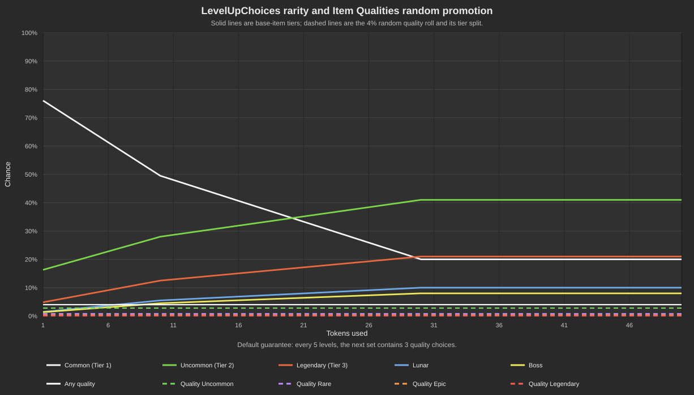

# LevelUpChoicesFixes

LevelUpChoicesFixes adds compatibility fixes and configurable quality support to [LevelUpChoices](https://thunderstore.io/package/karaeren/LevelUpChoices/) for **Risk of Rain 2**.

## Requirements

- [LevelUpChoices 1.1.3](https://thunderstore.io/package/karaeren/LevelUpChoices/)
- R2API Networking 1.0.3
- Optional: [Item Qualities](https://thunderstore.io/package/Gorakh/ItemQualities/)
- Optional: [Risk of Options](https://thunderstore.io/package/RiskofThunder/RiskOfOptions/)

Install this package with a Thunderstore-compatible mod manager. Item Qualities is required only for the quality features. Risk of Options is required only for the in-game settings screen.

## Opening the choice menu

Use the configured toggle-menu key to open or close the item choices when the notification shows that you have unused tokens.

## Quality features

When Item Qualities is installed, quality variants appear directly in LevelUpChoices item choices.

### Why guaranteed sets exist

LevelUpChoices can remove chests and other item sources, while Item Qualities normally gets many of its quality rolls from those sources. Guaranteed sets replace some of those lost opportunities with predictable quality choices during the level-up progression.

Default quality settings:

- Random quality chance: `4%` per ordinary offered item
- Guaranteed quality set: every `5` levels
- Choices in a guaranteed set: `3`
- Quality weights: Uncommon / Rare / Epic / Legendary = `70 / 20 / 8 / 2`
- Quality chests and printers: disabled when LevelUpChoices removes item sources

Guaranteed sets use the normal LevelUpChoices item-rarity progression. Early sets are usually white; green and red base items become more likely as you select more items. The quality tier is selected randomly using the configured quality weights.

If an earlier choice set is still waiting to be selected, the guaranteed set is queued until the next set is generated. Guaranteed quality settings do not replace or alter choices already on screen.

### Without guaranteed quality sets

Set `Guaranteed Quality Every N Levels` to `0` to use only the ordinary random quality chance. With the default `Quality Chance=4%`, each offered item has a `4%` chance to be quality. A three-item choice screen therefore has an `11.53%` chance of containing at least one quality item, but it is not guaranteed. Across 100 ordinary offered items, approximately 4 quality items are expected.

## Probability chart

The chart shows ordinary LevelUpChoices rarity progression and the `4%` random quality rate. The guaranteed quality setting is a periodic level-based event, so it is described below the chart rather than plotted as a token-based curve.

## Configuration

All settings are server/host settings in the `Server` section of the BepInEx configuration file. The same settings appear in Risk of Options when installed.

| Setting | Default | Description |
| --- | ---: | --- |
| Enable Quality Integration | `true` | Enable quality variants in level-up choices. |
| Quality Chance | `4%` | Random quality chance for ordinary offered items. |
| Guaranteed Quality Every N Levels | `5` | Queue a guaranteed quality choice set. Set to `0` to disable. |
| Guaranteed Quality Choice Count | `3` | Number of guaranteed quality choices. |
| Uncommon / Rare / Epic / Legendary Quality Weight | `70 / 20 / 8 / 2` | Relative quality-tier weights. |
| Allow Quality Chests | `false` | Keep Item Qualities chest and printer sources when LevelUpChoices removes item sources. |

Host settings are authoritative in multiplayer and synchronize to connected clients when a run starts or settings change.

## Other fixes

- Prevents quality variants from causing duplicate-item reroll and banish problems.
- Recovers cleanly when the choice menu is closed through the pause screen or when a run ends.
- Adds configurable reroll refresh, choice schedules, item blacklists, interactable preservation, interactable credit scaling, and XP curves.

## Support

Report issues with your mod versions, configuration values, host/client setup, and relevant `BepInEx/LogOutput.log` messages:

https://github.com/max-arias/level-up-fixes/issues
